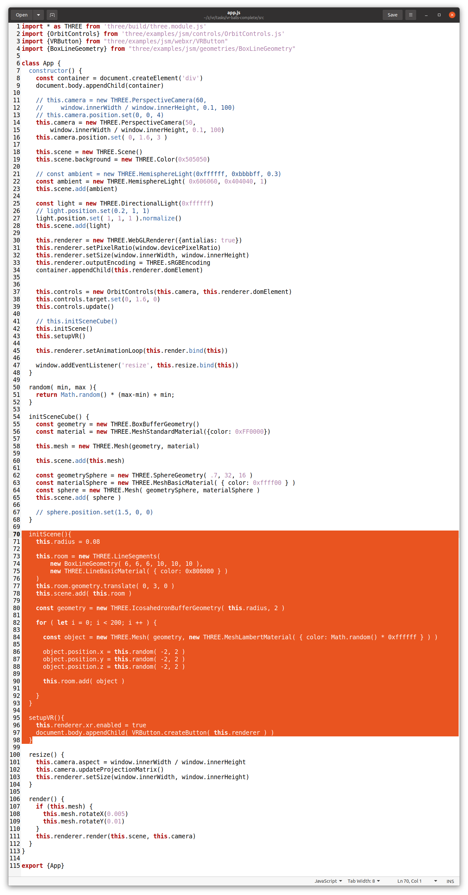
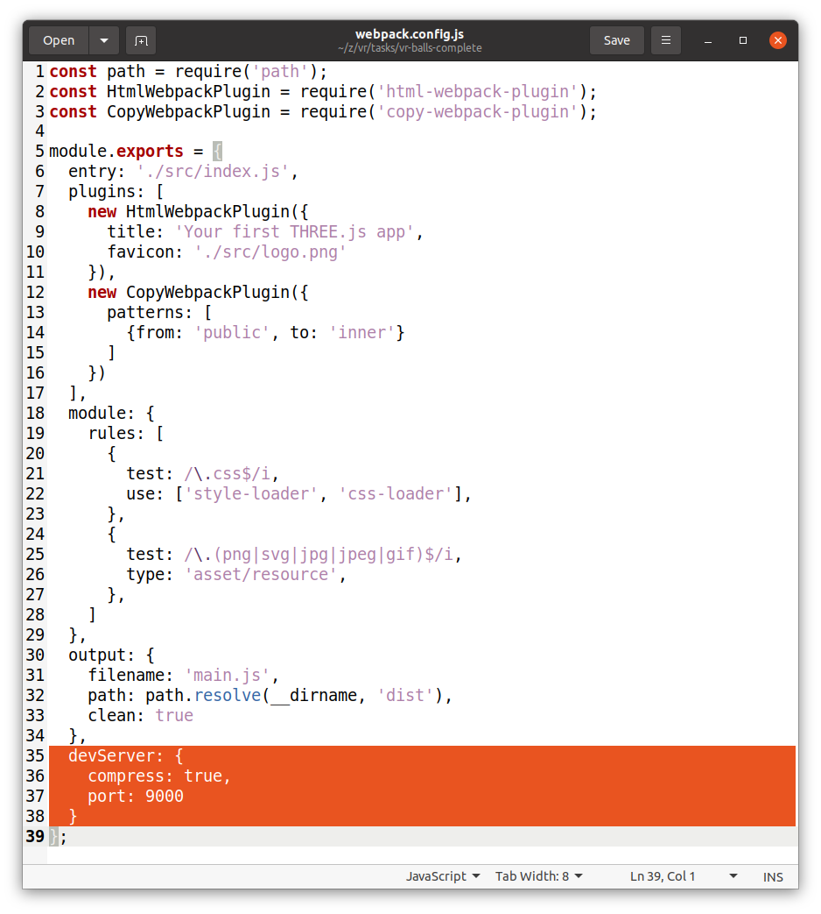
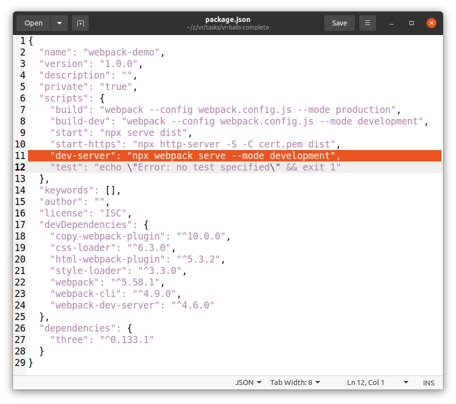
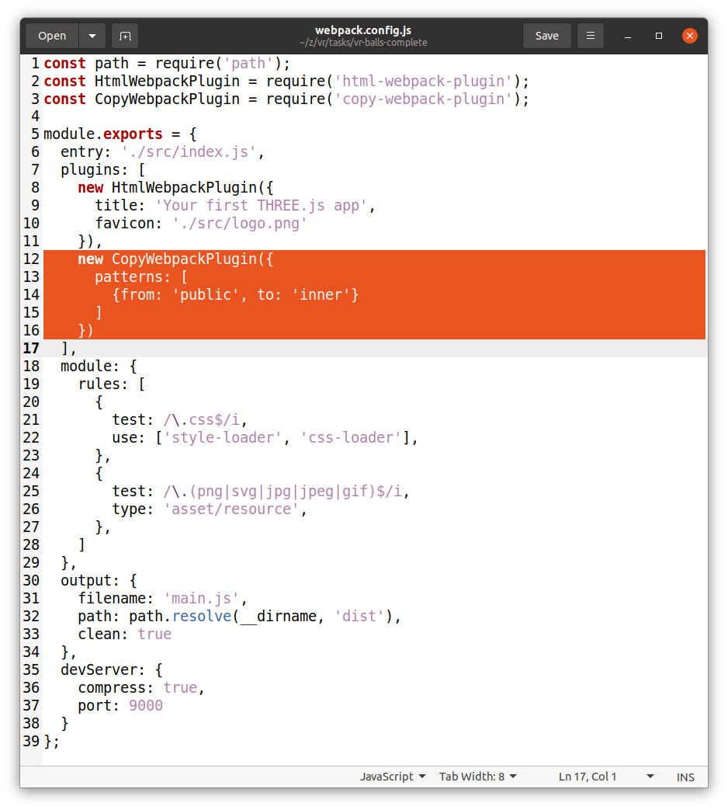
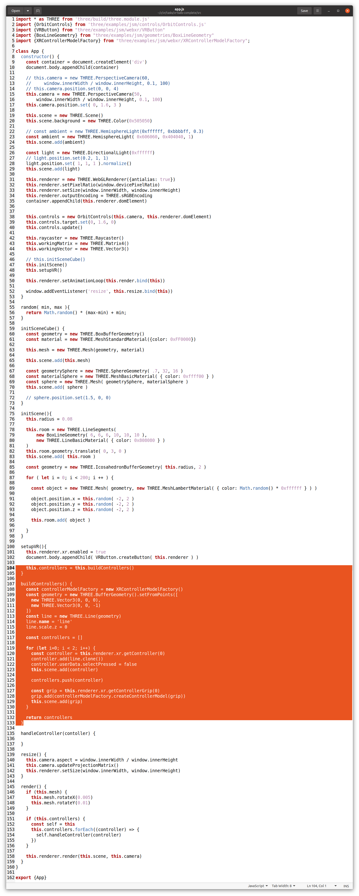

# VR Balls

## Step 1: Prepare 3D rendering for VR
1. Run `npm install`
2. Run `npm run build`
3. Open application in browser.
4. Add settings for VR and scene with balls: 

## For launching on VR headset
- generate a certificate: `openssl req -newkey rsa:2048 -new -nodes -x509 -days 3650 -keyout key.pem -out cert.pem`
- launch https-server: `npx http-server -S -C cert.pem -o`

## For Windows only: open server port
Link: https://creodias.eu/-/how-to-open-ports-in-windows-


## Step 2: Add webpack dev server and public folder

- Add dev dependency: `npm i webpack-dev-server --save-dev`
- Add configuration for `webpack-dev-server` plugin to the webpack-config.js
```
    devServer: {
    compress: true,
    port: 9000
    }
```
- Add script for starting dev server to the package.json: `"dev-server": "npx webpack serve --mode development",`
  
- Add dev dependency: `npm i copy-webpack-plugin --save-dev`
  
- Add configuration for `copy-webpack-plugin` plugin to the webpack-config.js
```
  plugins: [
    new CopyWebpackPlugin({
      patterns: [
        {from: 'public', to: ''}
      ]
    })
  ]
```



## Step 3: Add user interaction with a VR controllers

-- Add `buildControllers()` method and invoke it from `setupVR()`
```
  buildControllers() {
    const controllerModelFactory = new XRControllerModelFactory()
    const geometry = new THREE.BufferGeometry().setFromPoints([
      new THREE.Vector3(0, 0, 0),
      new THREE.Vector3(0, 0, -1)
    ])
    const line = new THREE.Line(geometry)
    line.name = 'line'
    line.scale.z = 0

    const controllers = []

    const controller = this.renderer.xr.getController(0)
    controller.add(line.clone())
    controller.userData.selectPressed = false
    this.scene.add(controller)

    controllers.push(controller)

    const grip = this.renderer.xr.getControllerGrip( 0)
    grip.add(controllerModelFactory.createControllerModel(grip))
    this.scene.add(grip)

    return controllers
  }
```

