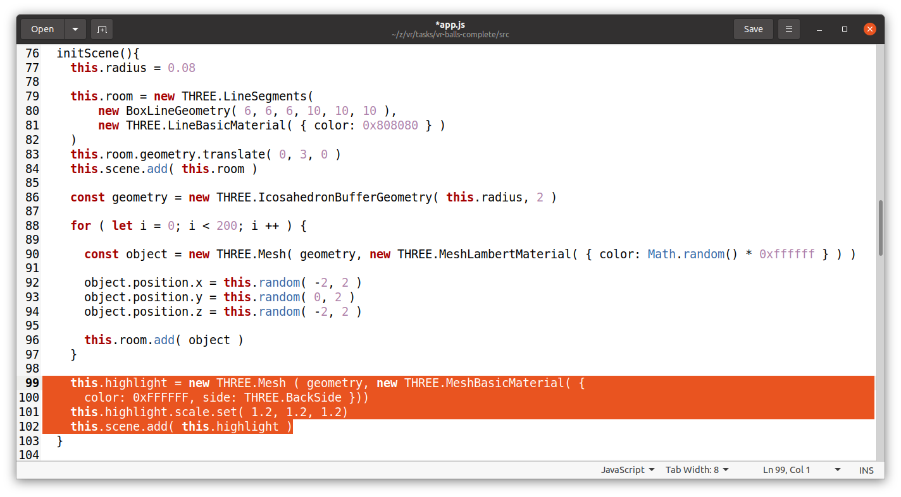
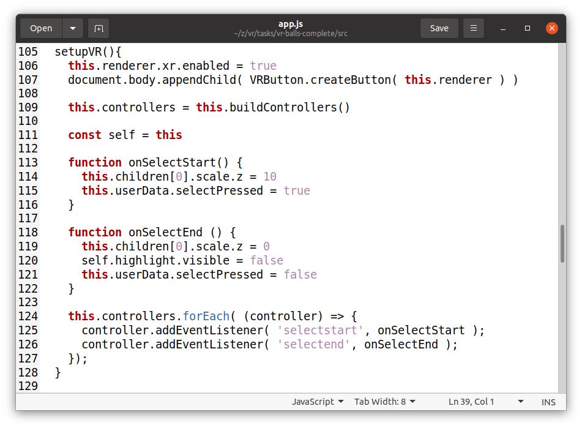
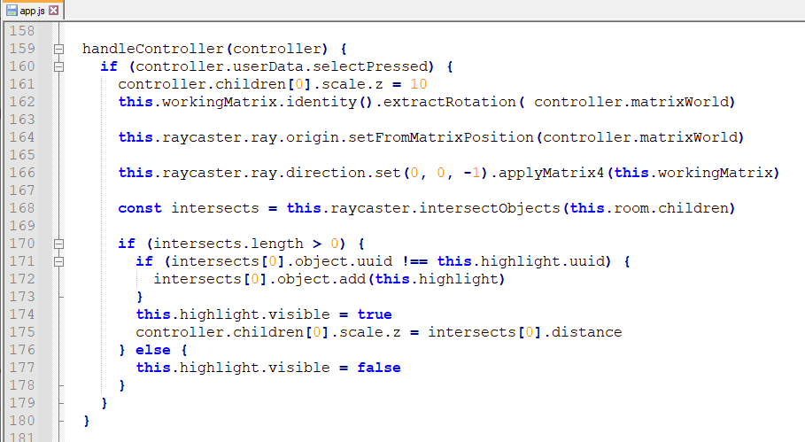
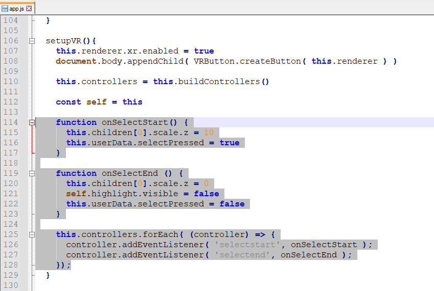
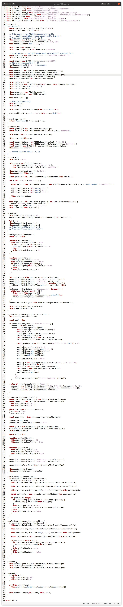

# VR Balls

## Step 1: Prepare 3D rendering for VR
1. Run `npm install`
2. Run `npm run build`
3. Open application in browser.
4. Add settings for VR and scene with balls: 

## For launching on VR headset
- generate a certificate: `openssl req -newkey rsa:2048 -new -nodes -x509 -days 3650 -keyout key.pem -out cert.pem`
- launch https-server: `npx http-server -S -C cert.pem -o`

## For Windows only: open server port
Link: https://creodias.eu/-/how-to-open-ports-in-windows-


## Step 2: Add webpack dev server and public folder

- Add dev dependency: `npm i webpack-dev-server --save-dev`
- Add configuration for `webpack-dev-server` plugin to the webpack-config.js
```
    devServer: {
    compress: true,
    port: 9000
    }
```
- Add script for starting dev server to the package.json: `"dev-server": "npx webpack serve --mode development",`
  
- Add dev dependency: `npm i copy-webpack-plugin --save-dev`
  
- Add configuration for `copy-webpack-plugin` plugin to the webpack-config.js
```
  plugins: [
    new CopyWebpackPlugin({
      patterns: [
        {from: 'public', to: ''}
      ]
    })
  ]
```


## Step 3: Add user interaction with VR controllers

-- Add `buildControllers()` method and invoke it from `setupVR()`
```
  buildControllers() {
    const controllerModelFactory = new XRControllerModelFactory()
    const geometry = new THREE.BufferGeometry().setFromPoints([
      new THREE.Vector3(0, 0, 0),
      new THREE.Vector3(0, 0, -1)
    ])
    const line = new THREE.Line(geometry)
    line.name = 'line'
    line.scale.z = 0

    const controllers = []

    const controller = this.renderer.xr.getController(0)
    controller.add(line.clone())
    controller.userData.selectPressed = false
    this.scene.add(controller)

    controllers.push(controller)

    const grip = this.renderer.xr.getControllerGrip( 0)
    grip.add(controllerModelFactory.createControllerModel(grip))
    this.scene.add(grip)

    return controllers
  }
```


## Step 4: Add object selection with VR controllers

- In `initScene()` method add `highlight` field to the class for indicating selected items
```
    this.highlight = new THREE.Mesh ( geometry, new THREE.MeshBasicMaterial( {
      color: 0xFFFFFF, side: THREE.BackSide }))
    this.highlight.scale.set( 1.2, 1.2, 1.2)
    this.scene.add( this.highlight )
```

  

- Add actions for press and release button on grip controller
  

- In `handleController()` method highlight first object which intersect controller grip beam
```
    if (controller.userData.selectPressed) {
      controller.children[0].scale.z = 10
      this.workingMatrix.identity().extractRotation( controller.matrixWorld)

      this.raycaster.ray.origin.setFromMatrixPosition(controller.matrixWorld)

      this.raycaster.ray.direction.set(0, 0, -1).applyMatrix4(this.workingMatrix)

      const intersects = this.raycaster.intersectObjects(this.room.children)

      if (intersects.length > 0) {
        intersects[0].object.add(this.highlight)
        this.highlight.visible = true
        controller.children[0].scale.z = intersects[0].distance
      } else {
        this.highlight.visible = false
      }
    }
```

  

- Each `render()` circle should invoke `handleController()` method for each grip

  

## Step 5: Add custom controller

In `setupVR` method add initializations for adding custom and standard controllers:
```javascript
  setupVR() {
    this.renderer.xr.enabled = true
    document.body.appendChild( VRButton.createButton( this.renderer ) )

    let i = 0
    this.flashLightController(i++)
    this.buildStandardController(i++)
  }

  flashLightController(index) {
    const self = this
  
    function onSelectStart() {
      this.userData.selectPressed = true
      if (self.spotlights[this.uuid]) {
        self.spotlights[this.uuid].visible = true
      } else {
        this.children[0].scale.z = 10
      }
    }
  
    function onSelectEnd () {
      self.highlight.visible = false
      this.userData.selectPressed = false
      if (self.spotlights[this.uuid]) {
        self.spotlights[this.uuid].visible = false
      } else {
        this.children[0].scale.z = 0
      }
    }
  
    let controller = this.renderer.xr.getController(index)
    controller.addEventListener( 'selectstart', onSelectStart );
    controller.addEventListener( 'selectend', onSelectEnd );
    controller.addEventListener( 'connected', function (event) {
      self.buildFlashLightController.call(self, event.data, this)
    })
    controller.addEventListener( 'disconnected', function () {
      while(this.children.length > 0) {
        this.remove(this.children[0])
        const controllerIndex = self.controllers.indexOf(this)
        self.controllers[controllerIndex] = null
      }
    })
    controller.handle = () => this.handleFlashLightController(controller)
  
    this.controllers[index] = controller
    this.scene.add(controller)
  }
```

  